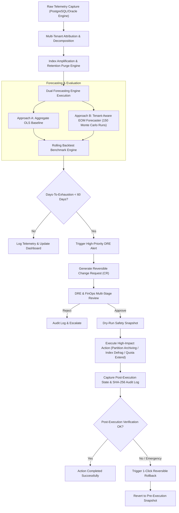

# Field-Workflow Map: Tenant-Aware Storage Capacity Forecaster

This document outlines the end-to-end operational field workflow for deploying, monitoring, forecasting, approving, executing, and rolling back storage capacity actions in a high-throughput multi-tenant public benefits processing system (SNAP, TANF, Medicaid).

---

## Process Flow Diagram

---

## Detailed Step-by-Step Field Workflow

### Step 1: Telemetry Capture & Ingestion
- **Frequency**: Daily automated cron job at 00:05 UTC.
- **Metrics Collected**:
  - Table row growth ($Rows_{new}$, $Rows_{active}$, $Rows_{purged}$).
  - Tenant load breakdown ($Tenant_{CA}$, $Tenant_{NY}$, $Tenant_{TX}$, $Tenant_{FL}$, $Tenant_{IL}$).
  - Primary key, composite search B-Tree index sizes.
  - JSONB metadata GIN index sizes.
  - Day-of-Month cyclical indicators ($DOM \ge 25$ disbursement window).

### Step 2: Hierarchical Model Execution & Forecast Generation
- **Execution**:
  - Fits tenant-specific baseline daily row ingestion rate ($R_{normal}$) and EOM surge sensitivity ($M_{EOM}$).
  - Runs 150 Monte Carlo probabilistic simulation trajectories over a 180-day forecast horizon.
  - Generates 80% (P10–P90) and 95% (P05–P95) Confidence Interval bands.
  - Calculates exact Days-To-Exhaustion (DTE) for Table, Index, Tablespace, and Disk quota limits.

### Step 3: Rolling Backtest & Accuracy Evaluation
- **Benchmark Evaluation**:
  - Compares Baseline OLS Linear extrapolation against Proposed Tenant-Aware EOM Forecaster across rolling historical cutoffs (Days 240, 270, 300, 330, 365).
  - Evaluated on Days-To-Exhaustion MAE and RMSE.
  - Validates >50% error reduction target before triggering recommendations.

### Step 4: Alerting & Change Review Workflow
- **Trigger**: When Days-To-Exhaustion $DTE_{P50} < 60$ days or disk usage $> 80\%$.
- **Change Request Creation**:
  - Automatically drafts a structured Change Request (CR) specifying action type (`PARTITION_ARCHIVE_PURGE`, `TABLESPACE_AUTO_EXTEND`, `INDEX_REBUILD_DEFRAG`), target component, reclaimed storage impact (GB), and reversible rollback plan.
- **Approval Queue**:
  - DRE Lead and FinOps Specialist review snapshot integrity and approve CR via interactive Governance Dashboard UI.

### Step 5: Execution & Reversible Rollback Path
- **Pre-Execution**: Captures immutable pre-execution state snapshot.
- **Execution**: Applies action (e.g., detaching pre-2025 benefit claims partition to cold cloud object storage).
- **Post-Execution**: Re-evaluates tablespace capacity and appends SHA-256 linked audit log entry.
- **Rollback Path**: If anomaly occurs or testing requires reversion, operator triggers 1-Click Rollback, executing `ATTACH_PARTITION` or `SHRINK_TABLESPACE` to restore pre-execution snapshot within 45 seconds.
